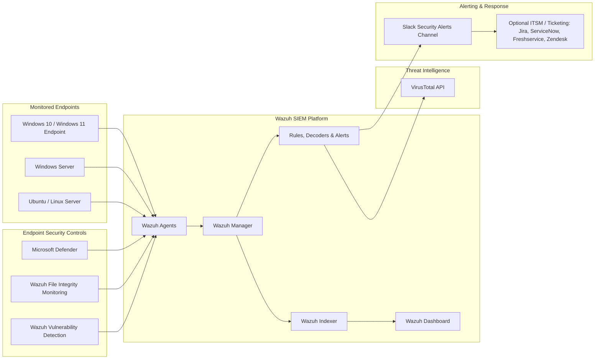

# SME Wazuh SIEM Deployment, Endpoint Monitoring & Security Automation Lab

> **Author:** Poul Mhiripiri  
> **Focus:** Wazuh SIEM deployment, endpoint telemetry, File Integrity Monitoring, Microsoft Defender log correlation, VirusTotal threat intelligence, vulnerability detection, and Slack alerting for SME security operations.

## Executive Overview

This project demonstrates an end-to-end Wazuh SIEM deployment designed for Small and Medium Enterprises that need practical security visibility without the cost and complexity of large commercial SIEM platforms.

The lab shows how Wazuh can be deployed as a central security monitoring platform, onboard Windows and Linux endpoints, collect security events, detect file integrity changes, enrich suspicious activity with threat intelligence, and push actionable alerts into collaboration channels for faster response.

The project is based on a hands-on virtualised environment and reflects the author's background supporting enterprise customers in ISP environments and managing network and infrastructure operations in a banking environment.

## What This Project Demonstrates to Recruiters

This repository demonstrates practical capability across:

- SIEM deployment and operational configuration using Wazuh Manager, Dashboard, and Agents.
- Windows and Linux endpoint onboarding.
- File Integrity Monitoring for critical directories and sensitive files.
- Microsoft Defender event collection and malware detection visibility.
- VirusTotal integration for file/hash reputation enrichment.
- Vulnerability detection and endpoint risk visibility.
- Slack integration for real-time security alerting and response collaboration.
- Incident detection use cases including failed logins, file changes, EICAR malware simulation, endpoint shutdown events, and vulnerability notifications.
- SME-focused security architecture that can be expanded into SOC, SOAR, ticketing, and compliance workflows.

## Architecture



## Repository Structure

```text
.
├── README.md
├── diagrams/
│   ├── wazuh-sme-architecture.mmd
│   └── wazuh-alert-flow.mmd
├── docs/
│   ├── 01-deployment-overview.md
│   ├── 02-agent-onboarding.md
│   ├── 03-file-integrity-monitoring.md
│   ├── 04-microsoft-defender-integration.md
│   ├── 05-virustotal-threat-intelligence.md
│   ├── 06-slack-alerting.md
│   ├── 07-vulnerability-detection.md
│   ├── 08-operational-use-cases.md
│   └── 09-publication-checklist.md
├── screenshots/
│   └── README.md
└── evidence/
    └── evidence-notes.md
```

## Key Components Implemented

### 1. Wazuh SIEM Deployment

The lab includes deployment of the Wazuh platform, including manager, dashboard, and endpoint agents. The Wazuh dashboard provides a central place to monitor endpoint activity, security events, vulnerabilities, and operational alerts.

### 2. Windows and Linux Agent Onboarding

The project demonstrates both Windows and Linux agent deployment. This is important in SME environments where organisations often operate mixed estates made up of Windows endpoints, Linux servers, virtual machines, and cloud workloads.

### 3. File Integrity Monitoring

Wazuh FIM was configured to monitor critical files and directories. The lab validates alerts for file creation, modification, deletion, and sensitive Linux file changes such as `/etc/passwd` after user account activity.

### 4. Microsoft Defender Integration

Microsoft Defender operational logs were forwarded into Wazuh to centralise endpoint malware visibility. The lab used EICAR testing to validate that Defender detection events could be observed and investigated through Wazuh.

### 5. VirusTotal Threat Intelligence

VirusTotal integration enriches suspicious file and hash events with external threat intelligence. This helps analysts validate whether files or indicators have been seen globally as malicious or suspicious.

### 6. Slack Alerting

Wazuh alerts were integrated with Slack so that security events could be delivered to a team channel in real time. This improves visibility and creates a bridge between SIEM detection and collaborative incident response.

### 7. Vulnerability Detection

The Wazuh vulnerability detection capability was enabled to provide visibility into endpoint weaknesses, vulnerable packages, and risk areas requiring remediation.

## Tested Security Use Cases

| Use Case | Control Area | Outcome |
|---|---|---|
| Windows failed login simulation | Authentication monitoring | Failed login alert visible in Wazuh |
| Windows file modification | File Integrity Monitoring | File change detected and logged |
| Linux `/etc/passwd` update after user creation | Linux FIM | Sensitive file change alert generated |
| EICAR test file | Defender + Wazuh | Malware simulation detected and correlated |
| VirusTotal enrichment | Threat intelligence | Suspicious file/hash reputation validation |
| Slack security alert | Security automation | Alert delivered to collaboration channel |
| Endpoint shutdown/startup activity | Endpoint monitoring | Operational security event visible |
| Vulnerability scan visibility | Vulnerability management | Endpoint risk presented in dashboard |

## Why This Matters for SMEs

Many SMEs need stronger cyber visibility but cannot always justify the licensing cost or operational complexity of large enterprise SIEM tools. This project shows how Wazuh can provide a practical security monitoring foundation covering endpoint visibility, log centralisation, threat detection, integrity monitoring, vulnerability awareness, and collaborative alerting.

## Recruiter Summary

This project demonstrates hands-on capability in deploying, integrating, and operationalising a SIEM platform. It shows practical knowledge across infrastructure, endpoint security, detection engineering, SOC workflows, vulnerability management, and security automation. The implementation is especially relevant for Network Security Engineer, Infrastructure Security Engineer, SOC Analyst, Cyber Security Engineer, Vulnerability Analyst, and Cloud/SIEM Engineer roles.

## Future Enhancements

- Add custom Wazuh rules for SME-specific detection logic.
- Integrate alerts with Jira, ServiceNow, or Freshservice for ticket creation.
- Add SOAR playbooks for automated containment actions.
- Extend monitoring to cloud workloads and container environments.
- Build executive dashboards for vulnerability trends, alert categories, and endpoint compliance.
- Add compliance mapping to PCI DSS, Cyber Essentials, ISO 27001, and CIS Controls.

## Disclaimer

This project was built in a controlled lab environment for learning, demonstration, and portfolio purposes. Any screenshots should be reviewed and redacted before public release.
